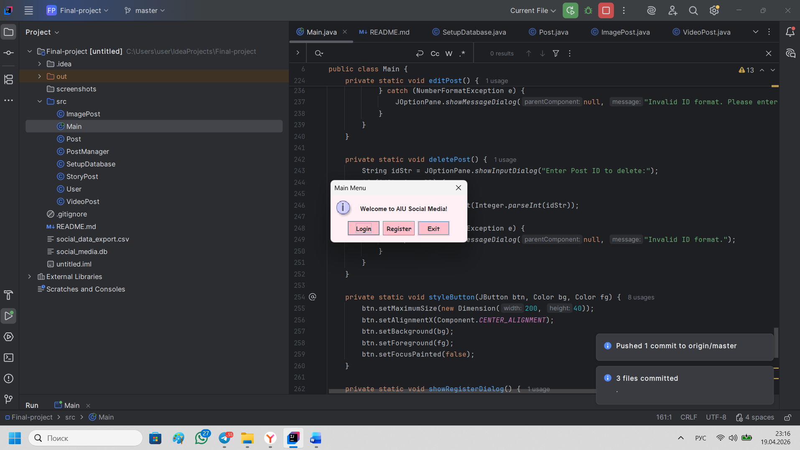
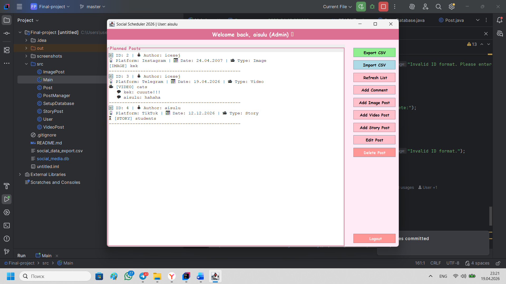
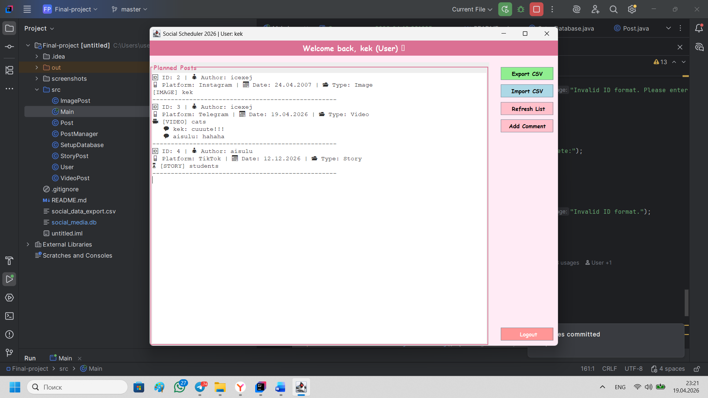
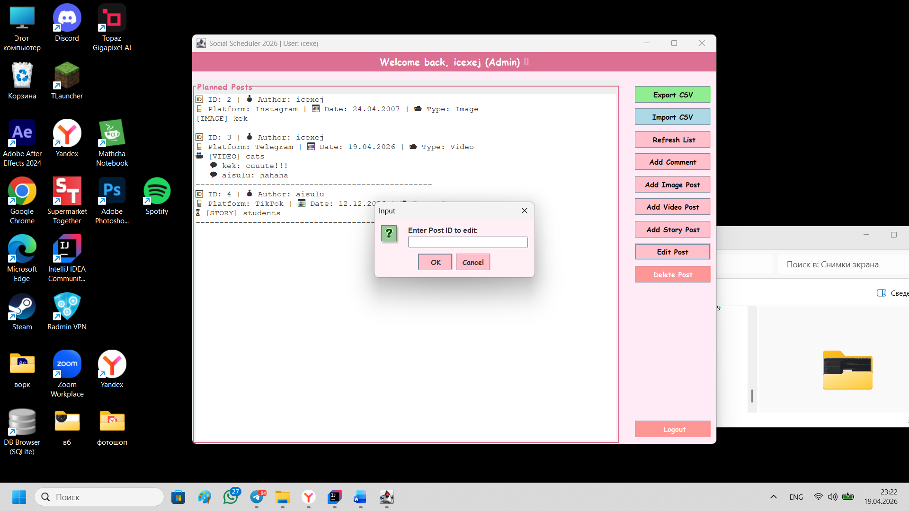
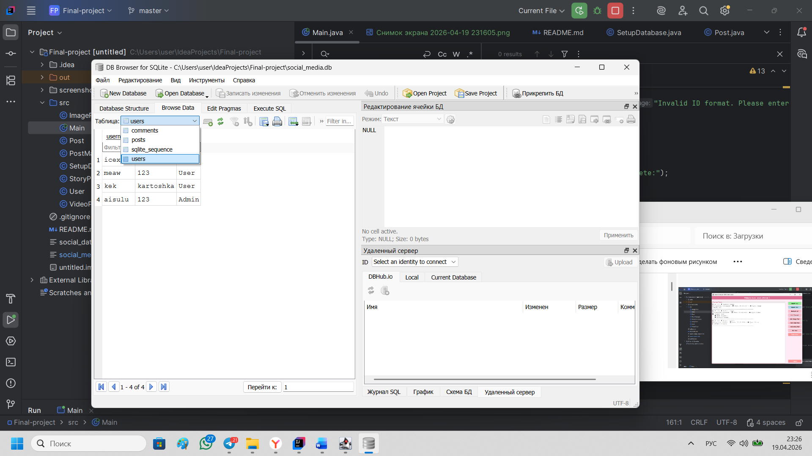
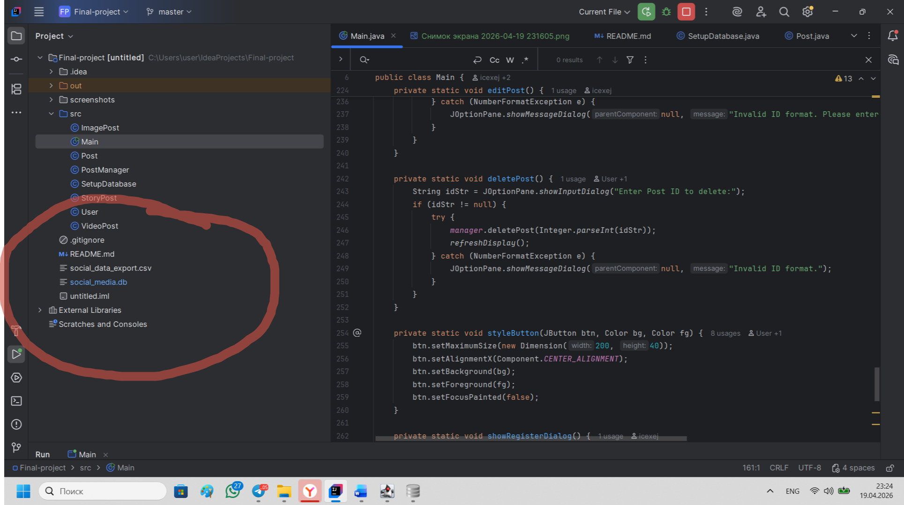

📱 Social Media Post Scheduler
Author: Alymbekova Aisulu (COMFCI-25)

University: Alatoo International University (AIU)

📝 Project Overview
This project is a content scheduler for social media. The app allows you to manage your posts (images, videos, stories), schedule dates and platforms, and store all your data in a secure database.

🎯 Objectives
Automation of the SMM content planning process.

Demonstration of OOP principles (Inheritance, Polymorphism, Encapsulation).

Implementation of reliable data storage using SQL.

Creation of an intuitive graphical user interface (GUI).

🛠️ Project Requirements Implementation (The Top 10)

CRUD operations: Full classification, Creation (Addition), Reading (Update), Update (Editing), Deletion.
GUI (Bonus): Swing interface in the signature pink style.

Database Integration (Bonus): Using SQLite to store posts and users.

Auth & Roles (Bonus): Login system with separation of rights (Admin/User) and secret code.

Inheritance: Parent Post class and three childs: ImagePost, VideoPost, StoryPost.

Polymorphism: getFormattedContent() method dynamically changes icons and output format.

Encapsulation: All class fields are protected (protected/private), accessed via getters.

Input Validation: Checks for empty fields when creating posts and validates dates.

Modular Design: Logic is divided between Main, PostManager, and model classes.

Data Export/Import: Supports saving and loading data via CSV files.

📂 Documentation & Algorithms

Data Structure: Using ArrayList<Post> to dynamically manage a list of posts in memory.

Storage: An SQLite relational database with posts, users, and comments tables.

Export Algorithm: Line-by-line reading from the database and writing to a file separated by a comma.

Challenges: One of the main tasks was to synchronize the ID between the database and the list in the GUI, which was solved through automatic Refresh after each operation.

---

## 📸 Screenshots & Proof of Work
*The following screenshots demonstrate the core functionality of the application. System date and time are visible in the corner as required.*

### 1. User Authentication (Login & Admin Access)

### 2. Main Dashboard (ADMIN)

### 3. Main Dashboard (USER)

### 4. CREATE

### 5. EDIT

### 6. Database

### 6. Database2

## 🔗 Project Links
* **Presentation:** [Canva Presentation Link](https://canva.link/gun4346bq7l57qp)
* **GitHub Repository:** [Link to this Repo](https://github.com/icexej/Final-project.git)

